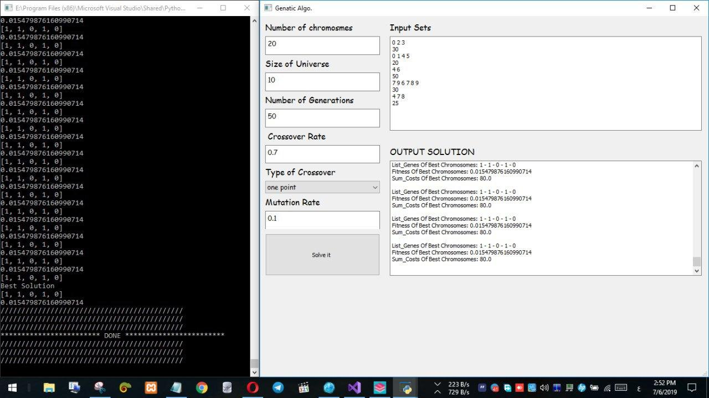

# SetCoverProplem
Python implementation for Set Cover Problem Selved using Genetic Algorithm

# Example

# Abstract
Experiences in artificial intelligence have traditionally focused on trying to replicate the behavior
of human beings - the smartest living organisms - and their application in software. This
approach has been somewhat successful, and the biggest example is the Deep Blue chess
machine, which beat intelligence The human simulation of Kasparov in May 1997, but the earlier
simulation of human behavior was somewhat limited, as it stood helpless to solve some of the
issues that most people know beforehand. The idea of computational intelligence such as
evolutionary computing ting, which provided the computer with the possibility of solving
complex problems without relying on human experience, but tried to take advantage of the
mechanism of evolution (proposed in Darwin's theory) and transform it into a computer model as
a procedural example. As in nature, the process of evolution in organisms is designed to adapt to
the environment for survival The process of evolution is always oriented toward what is best and
best for the organism - for example, the evolution of giraffes so that their necks are stretched to
reach their food of high leaves - survival of the fittest.
The idea of genetic algorithms - part of evolutionary computing - was actually put forward in the
United States in 1970 by a professor of computer science at the University of Michigan, John
Holland, He was 76 years old and had been working on it since the early 1960s, and his goal was
to develop an understanding of the processes of natural evolution and the design of industrial
systems with similar characteristics to natural systems.
Just as the continued drive to improve the performance of computational systems made genetic
algorithms attractive and appealing to solve some of the questions of examples that could not be
solved in a reasonable time using the rest of the conventional methods.
Local optimization rather than access to the general-analog solution, which often involves
gradient search methods, but in general, genetic algorithms tend to be cost-effective.
In the field of computing, the basic idea that showed the need for a kind of algorithms somewhat
similar to the mechanism of chromosomes in living organisms is the following:
Often, when we try to solve an issue, we have a solution every time. Unfortunately, this solution
is often not the optimal solution, but we can see that if we could combine this solution with one
solution in one way or another, In other words, if a number of solutions exist together at a given
moment, we can see that the optimal solution is one of them. Therefore, the existence of a
mechanism to integrate these solutions may at some point generate the optimal solution. If we
imagine each solution as a sequence of genes within a chromosome - In turn, within a range of
different chromosomes - several solutions to the problem - in combination of population, then we
can through the processes available on chromosomes - crucifixion and mutation - to produce new
solutions - new chromosomes sons - may be one of the best solution, and we can evaluate this
solution, The fitness function, which will measure the quality of this solution, and thus His
chance to survive, and move on to the next generation.
